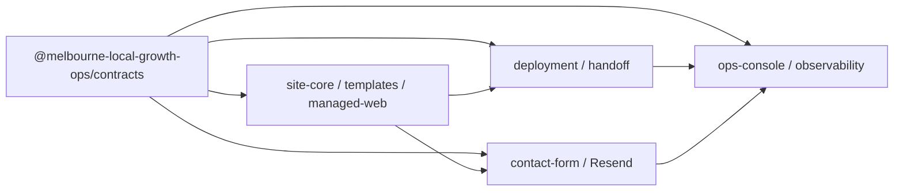

# M1 integration contracts

## Purpose and authority

This document defines the shared seams for M1 parallel delivery. It is
authoritative for feature-branch ownership and integration interfaces, while
the M0 product, architecture, and contract documents remain authoritative for
product and runtime rules. It does not replace
`@melbourne-local-growth-ops/contracts`.

The M1 Technical Build Plan used the conceptual names `apps/site-template` and
`tooling/deployment-generator`. This repository uses `apps/managed-web` and
`packages/deployment` plus `scripts/deployment` for those same responsibilities.
The naming change does not change the isolated-deployment architecture.

## Dependency flow

Dependencies flow away from contracts. Feature packages may consume deliberate
package-root exports, but must not deep-import another package's `src` or
`dist`. No public site may call the ops console as a shared runtime dependency.

## Shared interfaces

### ValidatedWebsiteConfiguration

`@melbourne-local-growth-ops/site-core` aliases the
`WebsiteRuntimeConfig` produced by TSK-45 and delegates validation to
`validateWebsiteRuntimeConfig`. Feature code must not create a competing
configuration model or accept an unvalidated object at a rendering boundary.

### WebsiteTemplate

A template receives a `ValidatedWebsiteConfiguration` and returns a stable
composition describing template identity, version, regions, and module
placements. Templates do not own commercial state, deployment credentials, or
cross-client data.

### WebsiteModuleContract

A module definition declares its closed TSK-45 module type, version, execution
boundary, infrastructure dependencies, portability, emitted analytics event
names, and explicit fallback behavior. Concrete rendering and server handlers
remain owned by feature packages.

### DeploymentManifest

`@melbourne-local-growth-ops/deployment` defines the transfer object shared by
build, deployment, ops, and handoff tooling. It contains client/configuration
identity and versions, application version, delivery mode, infrastructure
ownership, domains, build provenance, and optional M0 handoff state. It records
deployment intent and provenance; foundation code does not deploy anything.

### LeadDeliveryAdapter

`@melbourne-local-growth-ops/integrations` defines provider-neutral
configuration validation, idempotency declaration, a delivery request, and a
normalized success/failure result with retry classification. The adapter is
stateless by default and does not imply a database.

### ObservabilityEvent

`@melbourne-local-growth-ops/observability` defines a closed technical event
envelope with safe client/deployment attribution, timestamp, correlation ID,
category, and optional technical error/provider reference. It deliberately has
no form payload or generic metadata bag.

## Package ownership

| Stream | Owned packages and applications |
| --- | --- |
| Codex A | `apps/managed-web`, `packages/site-core`, `packages/templates`, `packages/asset-pipeline` |
| Codex B | `packages/deployment`, `scripts/deployment`, `scripts/handoff`, deployment runbooks |
| Claude Code | `packages/website-modules/contact-form`, `packages/integrations/resend` |
| Antigravity | `apps/ops-console`, `packages/observability` |
| Foundation/integration owner | root workspace files, `packages/contracts`, shared architecture and coordination docs |

The foundation creates only the four shared interface packages with real
contracts. Feature owners create applications and concrete feature packages in
their first vertical slices rather than inheriting empty scaffolds.

## Safe extension rules

Feature agents may add implementation types and package-local interfaces inside
owned paths. They may implement a shared interface without changing it. They
must not:

- add commercial data to public runtime configuration;
- add a database, auth, object storage, or jobs dependency by default;
- couple a handed-off site to private agency repositories or credentials;
- add form content or credentials to observability events;
- deep-import `packages/contracts` or edit its schemas;
- turn the ops console into a shared public multi-tenant site runtime.

## Interface-change requests

If a shared interface blocks a vertical slice, the agent creates a Markdown
request from `tasks/coordination/interface-requests/README.md`, commits it on
the feature branch, and continues behind a local adapter or mock where
possible. The integration owner reviews compatibility, test impact, and the
smallest sufficient change. Only the foundation/integration owner changes the
shared interface.

## Conflict hot spots

The likely conflicts are root `package.json`, `pnpm-workspace.yaml`,
`pnpm-lock.yaml`, root TypeScript settings, shared package entry points,
architecture docs, and assignments. Feature agents avoid these unless a
package dependency requires a lockfile update. During integration, regenerate
the lockfile from the merged manifests instead of choosing one side blindly.

## Integration strategy

All feature branches start at the pushed `integration/m1` foundation commit.
Agents push vertical slices but do not merge. The integration owner merges one
slice at a time with a merge commit, runs frozen install and `pnpm check`, and
only then proceeds to the next slice. `integration/m1` reaches `main` only
after all required M1 acceptance criteria and human approval.

## Developing against unfinished dependencies

Use package-root types and small in-memory test doubles:

- templates may use a fixture `ValidatedWebsiteConfiguration`;
- contact-form tests may use a mock `LeadDeliveryAdapter`;
- deployment tests may consume a fixture `DeploymentManifest`;
- the ops console may read a fixture registry and technical event stream.

Mocks must preserve the shared interface and must not invent extra production
fields. Replace them with real adapters through vertical slices, not a
cross-package rewrite.
